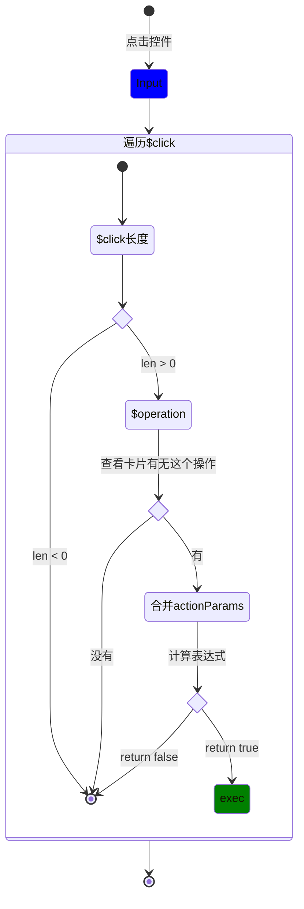

2023-04-15 19:32

```typescript
interface IPerson {
	name:string
	age:number
}
```



```mermaid
stateDiagram-v2	
	classDef inputStyle fill:blue
	classDef success fill:green

	[*] --> Input : 点击控件
	Input --> 遍历$click
	遍历$click --> [*]
	
 	state 遍历$click {
 		classDef success fill:#f1f2f3

 		state if_$clickLen <<choice>>
		state if_hasOp <<choice>>
		state if_runExr <<choice>>
	
	 	[*] --> $click长度
		$click长度 --> if_$clickLen
		if_$clickLen --> $operation:len > 0
		if_$clickLen --> [*]: len < 0
		%% 单个$operation对象[{operationId,actionParams}]
		$operation --> if_hasOp: 查看卡片有无这个操作
		if_hasOp --> 合并actionParams: 有
		if_hasOp --> [*]: 没有
		合并actionParams --> if_runExr: 计算表达式
		if_runExr --> [*]: return false
		if_runExr --> exec: return true

	}

	class Input inputStyle
	class exec success
```

