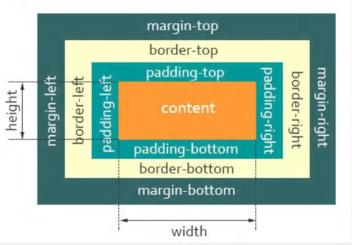

# 盒模型
## 定义
浏览器渲染引擎进行布局时，将所有元素表示为一个个矩形盒子。


## 盒模型
- 标准模型`box-sizing:content-box`,对其设置宽高只作用于`content box`区域
- ie 模型`box-sizing:border-box`,对其设置宽高会作用于`content box`,`padding box`和 `border box`区域

# 包含块

### 包含块的作用

元素的尺寸及位置，常常会受它的包含块所影响。对于一些属性，例如 width,height,padding,margin，绝对定位元素的偏移值（比如 position 被置为 absolute 或 fixed），当我们对其赋予百分比值时，其参考值是包含块的尺寸。

### 确定包含块

> 一个元素的包含块并不一定父元素的内容区

元素的包含块由其`position`决定：

- `static 、 relative 或 sticky `，包含块可能由它的最近的祖先块元素（比如说inline-block, block 或 list-item元素）的内容区的边缘组成（`content`）

- `absolute` ，包含块就是由它的最近的 `position 的值不是 static` （也就是值为fixed, absolute, relative 或 sticky）的祖先元素的内边距区的边缘组成（`content+padding`）

- `fixed`，在连续媒体的情况下(continuous media)包含块是 viewport ,在分页媒体(paged media)下的情况下包含块是分页区域(page area)。

>当元素祖先的 transform, perspective 或 filter 属性非 none 时,包含块是这个元素的内边距区 content+padding

### 根据包含块计算

- 要计算 `height` `top` 及 `bottom` 中的百分值，是通过包含块的 `height` 的值

- 要计算 `width`, `left`, `right`, **`padding`!, `margin`** 这些属性由包含块的 `width` 属性的值来计算它的百分值。
#### 题目
2. 实现一个div垂直水平居中高度为宽度的一半自适应
```css

/* 外层wrapper */

.outer-wrapper{

height:100vh;

width:100%;

display:flex;

/* flex默认行排列，所以这里设置侧轴对齐 */

align-items:center

}

/* 内层wrapper */

.inner-wrapper{

position:relative;

width:100%;

height:0;

padding-bottom:50%;

/* padding,margin值的百分比是相较于父元素width */

}

  

.div{

position:absolute;

/* 两个position设置都是为了确定包含块 */

width:100%;

height:100%;

/* 这里的高度就=>inner-wrapper[height+padding]=>outer-wrapper[width]*50% */

}

  

```

3. 实现div正方形大小自适应
```css

.wrapper{

position:relative;

padding-top:50%;

width:50%;

/* 同样相较于包含块的尺寸百分比 */

/* width和padding都等于wrapper包含块的宽度的一半 */

}

.div{

position:absolute;

top:0;

left:0;

/* 偏移到wrapper位置 */

width:100%;

height:100%;

}

  
  

/* 也可使用伪元素撑开高度 */

.div{

width:50%;

/* 触发BFC避免塌陷 */

display:flow-root

}

.div::after{

content:'';

margin-top:100%;

display:block

}

```