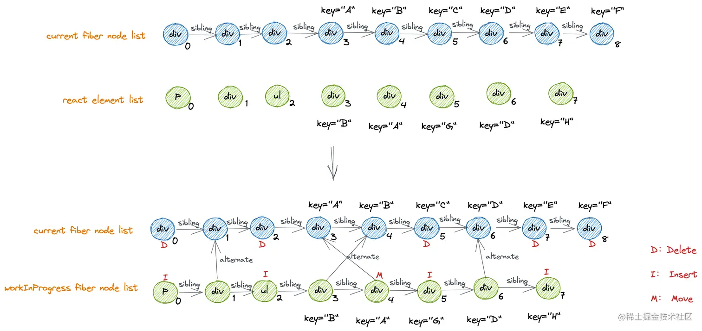

## 同级比较
workinProgressFiberNode的直接子节点和currentFiberNode的直接子节点进行比较。不进行跨父节点比较。

### 节点复用
- ⭐️key：`元素上的key = reactElement的key = fiber节点上的key
- type：div,input,component,fragemt等
 
 克隆 currentFiberNode(复用节点)的条件：
`reactElement.key === currentFiberNode.key && reactElement.type === currentFiberNode.type`

### 最长递增索引K
`lastPlacedIndex`为新fiber节点在旧fiber节点中能匹配上的最大索引值，定位未发生移动的currentFiberNode。
```javascript
// currentFiberTree
A->B->C->D

// workingInProgressTree
C->B->A->D
// newChildren [C,B,A,D]
// K [2,1,0,3]

// 由于fiber为链表，计算时会为oldChildren构建哈希表便于比较
```
1. 从直接子节点（DOM结构中的首个子节点）开始
2. C的newIndex为0, oldIndex为2, lastPlacedIndex初始化=2
3. B的newIndex为1，oldIndex为1，oldIndex<lastPlacedIndex,B发生了移动
4. A的newIndex为2，oldIndex为0，oldIndex<lastPlacedIndex,A发生了移动
5. D的newIndex为3，oldIndex为3，oldIndex>lastPlacedIndex,D没有移动，并且重新赋值lastPlacedIndex = 3


[掘金/百应技术团队博客](https://juejin.cn/post/7012961682938920967#heading-9)
## 更新节点
- 新建的节点 -> 执行mount
- 克隆的节点-> 比较props -> 执行update
- 克隆的组件节点 -> 比较props -> 比较state -> 执行update
### Fiber.props
通过对比**pendingProps** 和 memoizedProps就知道属性的改变；
#### `pengindProps`
jsx上的所有参数除了key都会直接作为react element的props，react element执行渲染函数后这些props将作为workingProgress fiber node 下`pendingProps`的值。
#### `memoizedProps`
节点更新完之后的props。
current fiber node的`memorizedProps`也就是上一次更新时workingProgress fiber node的`pengingProps`。

### Fiber.tag
标记不同的fiber节点类型
- **ClassComponent**类组件
- **FunctionComponent**函数组件
- **HostComponent**DOM元素
- **Fragment**
- **SuspenseComponent**
不同节点类型执行更新的操作步骤也不同。

### 组件状态
组件类型的tag相同时，还需要比较组件内部状态的不同。


## 不同情况下Diff差异
在 React 16+ 的 Fiber 架构中，**Diff 过程**主要发生在 **新旧 Fiber 树的对比**，而新旧节点的核心对比逻辑依赖于 **链表遍历** 和 **Keyed Diff**。

## **1. 直接对比（O(N))**
在最理想的情况下，如果 **新旧节点的顺序没有变化**，React 只需要**逐个遍历**并比较节点是否相同。这种情况下，时间复杂度是：`O(N)`
其中 **N** 是子节点的数量。

**示例：**
```js
// 旧 Virtual DOM
<ul>
  <li>A</li>
  <li>B</li>
  <li>C</li>
</ul>

// 新 Virtual DOM（顺序不变）
<ul>
  <li>A</li>
  <li>B</li>
  <li>C</li>
</ul>
```

**计算过程：**
React 遍历 **每个子节点** 并比较 type 和 props，总共执行 **N 次** 对比操作。

## 2. 无 **key 情况（O(N²))**
如果 **节点顺序发生变化**，但**没有 key**，React 仍然采用**逐个遍历**的方式去寻找匹配的旧节点，这会导致**嵌套循环**：`O(N^2)`

**示例：**

```js
// 旧 Virtual DOM
<ul>
  <li>A</li>
  <li>B</li>
  <li>C</li>
</ul>

// 新 Virtual DOM（B 和 A 互换）
<ul>
  <li>B</li>
  <li>A</li>
  <li>C</li>
</ul>
```

**计算过程：**

1. **第 1 次循环（找 B）**
	- 旧 A 不匹配 → 继续查找
	- 旧 B 匹配 → 交换 A 和 B

2. **第 2 次循环（找 A）**
	- 旧 B 不匹配 → 继续查找
	- 旧 A 匹配 → 交换 A 和 B

3. **C 匹配**

由于 React **在每个位置都要检查所有可能的旧节点**，导致 **N 个节点，每个节点都可能触发一个 O(N) 级别的匹配搜索**，最终复杂度：`O(N^2)`

## **3. Keyed Diff 优化（O(N))**
**当使用 key 进行优化时**，React **使用 Map 结构（哈希表）存储旧节点的索引**，这样新旧节点可以 **O(1)** 查找，整体复杂度降至：`O(N)`

**示例（使用 key）：**
```jsx
<ul>
  <li key="A">A</li>
  <li key="B">B</li>
  <li key="C">C</li>
</ul>

// 新 Virtual DOM（B 和 A 互换）
<ul>
  <li key="B">B</li>
  <li key="A">A</li>
  <li key="C">C</li>
</ul>
```

**计算过程：**

1. **React 先遍历旧节点，构建一个 Map（哈希表）**
	```js
	{
	  "A": oldFiberA,
	  "B": oldFiberB,
	  "C": oldFiberC
	}
	```
**时间复杂度：O(N)**
 
2. **遍历新节点，直接查找 Map 进行匹配**
	- B 在 Map 里 → 复用 B
	- A 在 Map 里 → 复用 A
	- C 在 Map 里 → 复用 C
**时间复杂度：O(N)**

由于 Map 允许**O(1) 查找**，所以整体复杂度降低至：`O(N)`
