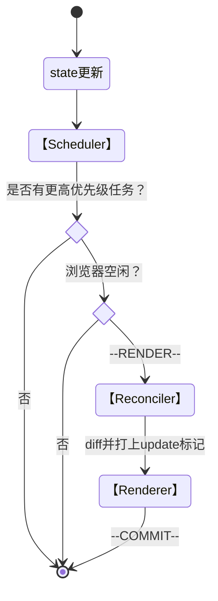

# React Fiber
> - reconciliation
> 	The algorithm React uses to diff one tree with another to determine which parts need to be changed.
> - scheduling
> 	the process of determining when work should be performed.
## Fiber架构
### <16.8 旧架构
- `Stack Reconciler`
	- 数据保存在递归的调用[[栈]] 中
	- 递归更新不可中断
- `Renderer`
### >16.8 新架构
- `Scheduler`
- `Fiber Reconciler`
	- 协调过程可中断与恢复
	- 时间切片
	- 更新任务可区分优先级
- `Renderer`


### 运行流程

### `FiberNode`
用于保存一个React组件的状态，输入及输出的对象。
```javascript
function FiberNode(
  this: $FlowFixMe,
  tag: WorkTag,
  pendingProps: mixed,
  key: null | string,
  mode: TypeOfMode,
) {
  // Instance
  this.tag = tag;
	/*
		0 Function 组件
		1 Class组件
		9 ContextConsumer
		10 ContextProvider
		11 ForwardRef
		...
	*/
  this.key = key; // diff用
  this.elementType = null;
  this.type = null;
  this.stateNode = null; // DOM节点

  // Fiber
  this.return = null;
  this.child = null;
  this.sibling = null;
  this.index = 0;

  this.ref = null;
  this.refCleanup = null;

  this.pendingProps = pendingProps;
  this.memoizedProps = null;
  this.updateQueue = null;
  this.memoizedState = null;
  this.dependencies = null;

  this.mode = mode;

  // Effects
  this.flags = NoFlags;
  this.subtreeFlags = NoFlags;
  this.deletions = null;

	/** Lanes模型
		判断task优先级与从属关系		
	*/
  this.lanes = NoLanes;
  this.childLanes = NoLanes;

  /* diff匹配的fiber节点 */
  this.alternate = null;

  if (enableProfilerTimer) {
    // Note: The following is done to avoid a v8 performance cliff.
    //
    // Initializing the fields below to smis and later updating them with
    // double values will cause Fibers to end up having separate shapes.
    // This behavior/bug has something to do with Object.preventExtension().
    // Fortunately this only impacts DEV builds.
    // Unfortunately it makes React unusably slow for some applications.
    // To work around this, initialize the fields below with doubles.
    //
    // Learn more about this here:
    // https://github.com/facebook/react/issues/14365
    // https://bugs.chromium.org/p/v8/issues/detail?id=8538
    this.actualDuration = Number.NaN;
    this.actualStartTime = Number.NaN;
    this.selfBaseDuration = Number.NaN;
    this.treeBaseDuration = Number.NaN;

    // It's okay to replace the initial doubles with smis after initialization.
    // This won't trigger the performance cliff mentioned above,
    // and it simplifies other profiler code (including DevTools).
    this.actualDuration = 0;
    this.actualStartTime = -1;
    this.selfBaseDuration = 0;
    this.treeBaseDuration = 0;
  }

  if (__DEV__) {
    // This isn't directly used but is handy for debugging internals:
    this._debugInfo = null;
    this._debugOwner = null;
    if (enableOwnerStacks) {
      this._debugStack = null;
      this._debugTask = null;
    }
    this._debugNeedsRemount = false;
    this._debugHookTypes = null;
    if (!hasBadMapPolyfill && typeof Object.preventExtensions === 'function') {
      Object.preventExtensions(this);
    }
  }
}

```

## `Scheduler`
基于`requestIdleCalllback`封装的浏览器空闲回调执行函数，调度协调的进行。
```javascript
window.requestIdleCallback(callback:Function, options:{timeout:number})
// timeout 可设置运行的deadline
```

## `Fiber Reconciler`
执行fiber树的协调，虚拟dom的diff，打上更新标记，并收集副作用。


## `Renderer`
根据不同的标记更新到真实DOM结构上。


