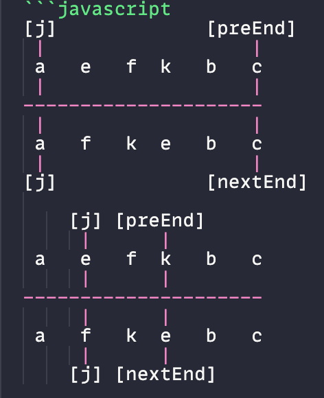

## Vue2的双端比较
> 借鉴`snabbdom.js`
```javascript
(oStart)      [oEnd]
oldA oldB oldC oldD

  

newB newC newD newA
(nStart)       [nEnd]

// oStart与nEnd匹配上了key，将oldA的DOM移动到新dom最后
// 移动nEnd
(oStart)      [oEnd]
oldA oldB oldC oldD
｜
---------------------->
                ｜
newB newC newD newA
(nStart) [nEnd]
```

- vue同时从新旧children的两端开始比较
- 四个指针，分别查找是否key相同
- 匹配到了相同的key，则将真实dom移动,同时四个指针对撞移动
- 如果第一轮四次匹配不上，则遍历旧node寻找`nStart`
- if 找到将其真实DOM移动到`oStart`之前，并在原vnode位置置空undefined，后序比较会跳过他
- else 找不到则添加新增新元素`nStart`到`oStart`之前
- 匹配结束后`oEnd<oStart`,新增`nStart到nEnd`新元素到`oStart`之前
- 匹配结束后`nStart>nEnd`,删除`oStart到oEnd`之间元素

## Vue3 借鉴`inferno`和`ivi`的算法
- **静态标记**：模板编译时，会提前标记哪些节点是**静态的**，避免重复对比。
- **双端 Diff**：Vue 采用 **头尾指针**，同时从两端对比，提高性能。
### 1.排除相同的首位节点

- 分别从新旧节点的头和尾出发
- 依次遍历到key值不一样时停止
- 这样匹配成功后剩下的部分就是需要新增/删除的vNode们

### 2.使用剩余新children的长度建立source索引数组
```javascript
oldChildren = [e,f,k]
newChildren = [f,k,e]

// 初始化 source = [-1,-1,-1]
```

### 3.为新vnode建立key，index索引表

```javascript
keyIndex = {f:0,k:1,e:2}
```

遍历旧children中key去keyIndex中查找`k = keyIndex[oldChildren[i]]`，有这个k则把`source`数组该位置的-1改为旧vNode的索引，并且patch该节点 ;`k=undefined`则说明该节点已经被删除，而source中依旧为-1的节点为新增节点

```javascript
source = [2,0,1]
```

- 判断是否需要移动

```javascript
source = [2,0,1]
//source中，最大索引为2，2之后有小于2的索引，说明需要移动
//根据source数组求出最长递增子序列
LIS = [1，2]
// LIS中存储的是source索引
// 表示新旧children中这几个节点位置保持递增关系
```

### 4. 根据LIS得出不进行移动的节点

```javascript
newChildren[LIS] = [f,k]
```

- 从LIS和新children尾处建立两个指针处理余下节点
- 比较指针的索引是是否相同，不同则移动DOM位置到上个指针的真实DOM之前

> oldVnode.el = 真实DOM，同时source.key = -1的节点直接创建了新的真实DOM

### 最长递增子序列
- 子序列：不要求连续
- 字串：要求连续
```javascript
// 动态规划
// 最长递增子序列的长度
const longestChildSequence = arr => {
	let len = arr.length
	if(len < 1) return
	const dp = Array(len).fill(1)
	// dp[i]代表原始数组该位置的最长子序列长度
	for(let i = 1 ; i < len ; i++){
		for(let j = 0 ; j < i ; j++){
			// j遍历之前遍历过的所有元素
			// 可能存在大小不一的递增序列，使用max取得最大值
			if(arr[i] > arr [j]){
				dp[i] = Math.max(dp[i],dp[j]+1)
				// [1,2,3,4,1,2,5]
				// 如果只使用dp[j]+1 ，dp[6]会在[1,2,5]中得出结果3
				// 使用max比较之前更长的序列[1，2，3，4，5]得到5
			}
		}
	}
	return Math.max(...dp)
}

// 贪心+二分
const longestChildSequence = arr => {
	const len = arr.length
	if(len < 1) return
	const res = [arr[0]]
	//将arr中后续元素arr[i]与res末尾元素比较
	//大于则push进res
	//小于则查找res中第一个比arr[i]大的元素并替换
	//由于存在替换，子序列值不一定正确，但长度是正确的
	for(let i = 0 ; i< len ;i++){
		if(arr[i]>res[res.length-1]){
			res.push(arr[i])
		}else{
		// res中左右指针的index
		// 二分查找
		let left = 0
		let right = res.length - 1
		
		while(left<right){
		
			const mid = Math.floor((left+right)/2)
			// 浮点小数向下求整
			if(arr[i]>res[mid]){
				left = mid + 1
			}else{
				right = mid
			}
		}
		
		res[left] = arr[i]
	
		}
	
	}

	return res.length

}

```