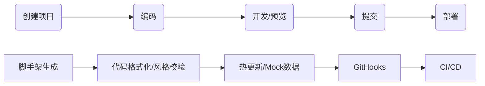

# 工程化流程

  



  

## 脚手架

  

### 脚手架结构

  

- 制定 cli 入口文件

```javascript

// package.json

{

'bin':'cli.js'

}

```

- cli 入口文件头部

```javascript

// ./cli.js

#!/usr/bin/env node

```

- 命令结构

```javascript

cli <command> [options] --options params

<!-- // eg: -->

vue create my_app -p env=...

```

  

### npm 包本地开发

  

- 链接本地 npm 包的依赖库

  

```javascript

// xxx-lib dir

npm link

// current module package.json

dependencies:{

+ "xxx-lib":"^1.0.0"

}

// current module dir

npm link xx-lib

```

  

- 解除本地 xxx-lib 和当前包的链接

  

```javascript

// xxx-lib dir

npm unlink

// current module dir

rm -rf node_modules

npm unlink xxx-lib

```

  

- 链接当前项目到全局`node_modules`

```javascript

npm link/unlink

```

- 相对于当前`node_modules`操作

```javascript

npm link B // 添加依赖B

npm unlink B // 移除依赖B

```

  

### Lerna

  

基于 Git+Npm 的多 package 项目管理工具

  

1. 解决原生脚手架开发中的重复操作

  

- 多 package 本地 link

- 多 package 依赖安装

- 多 package 单元测试

- 多 package 代码提交

- 多 package 代码发布

  

2. 解决版本一致性

- package 版本一致

- 相互依赖版本升级

  

#### lerna 开发 module 流程

  

3. 项目创建

  

```javascript

npm init

npm i lerna

lerna init

```

  

4. 创建 package

  

```javascript

lerna create // 创建package

lerna add //安装依赖

lerna //链接依赖

```

  

5. 开发测试

  

```javascript

lerna exec // 执行shell脚本

lerna run

lerna clean // 清空依赖

lerna bootstrap // 重装依赖

```

  

6. 发布上线

  

```javascript

lerna version // 提升版本号

lerna change // 查看变更

lerna diff // 查看diff

lerna public // 发布

```

  

### Yeoman

  

- 命名规范`generator-<name>`

- 目录规范

  

```javascript

app - // 默认生成器

index.js - // 默认实现

other - // 其他生成器

index.js - // 其他生成器实现

package.json; // 模块包配置文件

```

  

#### Yeoman使用

  

7. 安装依赖

```javascript

// ./generator-xxx

  

yarn init

yarn add yeoman-generator // 必要依赖

```

  

8. 自定义generator

  

```javascript

// ./app/index.js

const Generator = require("yeoman-generator");

  

// ./app/index.js

module.exports = class extends Generator {

writing() {

// 写入文件

this.fs.write(this.destinationPath("random.txt"), Math.random().toString());

}

};

```

  

9. 执行generator

  

```bash

yarn link

  

cd desktop

  

yo <你的generator名>

  

# desktop/random.txt

# 随机数

```

  

10. 接收用户输入

  

```javascript

prompting() {

return this.prompt([

{

type: "input",

name: "name",

message: "your project name",

default: this.appname,

},

]).then((a) => {

this.answers = a

// 挂在到全局对象answers

// { name: '123' }

});

}

```

  

### 模版引擎

  

[EJS](https://ejs.co/#docs)

  

```html

<!-- app/templates/bar.html -->

<body>

<div><%=name %></div>

</body>

```

  

```javascript

// app/index.js

// 模版文件路径

const tmpl = this.templatePath("bar.html");

const output = this.destinationPath("bar.html");

const context = this.answers;

this.fs.copyTpl(tmpl, output, context);

```

  

生成

  

```html

<body>

<div>123</div>

</body>

```

  

### Plop

  

小型的脚手架工具,[=>](https://github.com/plopjs/plop)

  

### 使用

  

11. 项目中安装 plop

```bash

yarn add plop

```

12. `plopfile.js`

```javascript

module.exports = plop => {

plop.setGenerator('component',{

description:'create a component',

prompts:[

{

type:'input',

name:'name',

message:'your component name',

default:'My Component'

}

],

actions:[ // 多个action

{

type:'add'// 添加文件

path:'src/components/{{name}}/{{name}}.js',

templateFile:'plop-templates/component.hbs'

},

{

type:'add',

path:'src/components/{{name}}/{{name}}.css',

templateFile:'plop-template/component.css.hbs'

}

]

})

}

```

13. 模版文件

[handlebars](https://github.com/handlebars-lang/handlebars.js)

  

```javascript

// plop-templates/components.hbs

import React from 'react'

export default () => {

<div className="{{name}}">

<h1>{{name}} Component</h1>

</div>

}

```

  

14. usage

```javascript

yarn plop component

```

  

## 构建工具

  

### npm script

  

```javascript

"script":{

"build":"sass main.sass main.css -watch",

"preserve":"yarn build",

"serve":"browser-sync .", // browser-sync

"start":"run-p build serve" // npm-run-all

}

```

  

### Grunt

  

```javascript

// __dir/gruntfile.js

modules.exports = (grunt) => {

grunt.registerTask("default", () => {

// 使用yarn grunt就能执行

});

grunt.registerTask("foo", "foo 的描述", () => {

// 使用yarn grunt foo执行

});

grunt.registerTask("default", ["foo", "bar"]);

};

```

  

#### 异步 task

  

grunt task 默认是同步代码

```javascript

module.exports = (grunt) => {

// 异步任务要获取this,不能用=>函数

grunt.registerTask("async-task", function () {

const done = this.async();

setTimeout(() => {

// ...

done(); // 调用这个done才结束task

}, 3000);

});

};

```

  

#### task 失败

  

- 在 task 中`return false`标记 task 失败

```javascript

grup.registerTask("fail-task", () => {

//...

return false;

});

```

- 在异步 task 中给 done 传 false 参数

```javascript

grup.registerTask("fail-async-task", function () {

const done = this.async();

//...

setTimeout(() => {

//...

done(false);

}, 3000);

});

```

- 如果是一个 task 数组，会在失败处中断

- 可以加上`--force`强行执行所有 task

  

#### task 配置

  

```javascript

module.exports = (grunt) => {

grunt.initConfig({

foo: {

bar: "666",

},

});

  

grunt.registerTask("foo", () => {

// 获取配置

console.log(grunt.config()); // { foo: { bar: '666' } }

console.log(grunt.config("foo")); // { bar: '666' }

console.log(grunt.config("foo.bar")); // 666

});

};

```

  

#### 多目标task

  

```javascript

grunt.initConfig({

"multi-task1": {

options: {

// 任务配置选项

foo: "bar",

},

// 除了options外都会注册为目标

t1: "1",

t2: {

options: {

foo: "baz",

},

name: "target222",

},

},

});

grunt.registerMultiTask("multi-task1", function () {

console.log(this.options(), this.data.options ? "options被覆盖" : "无覆盖的options");

console.log(`target=>${this.target};data=>${this.data.name}`);

// Running "multi:t1" (multi) task

// { foo: 'bar' } 无覆盖的options

// target=>t1;data=>undefined

  

// Running "multi:t2" (multi) task

// { foo: 'baz' } options被覆盖

// target=>t2;data=>target222

});

```

  

- 只执行单个目标

  

```javascript

yarn gulp multi-task1:[目标名]

```

  

#### grunt插件

  

[https://www.gruntjs.net/plugins](https://www.gruntjs.net/plugins)

命名规范:`grunt-contrib-[pluginName]`

  

- grunt-contrib-clean

```javascript

// 是一个多目标任务

grunt.initConfig({

// 配置插件

clean: {

cleanTestDirText: "test/*.txt", // 删除./test/*.txt

cleanTestAllDir: "testAll/*", // 删除./testAll/*

},

});

// 加载插件

grunt.loadNpmTasks("grunt-contrib-clean");

```

- grunt-sass

  

```javascript

grunt.initConfig({

// 配置插件

sass: {

options: {

sourceMap: true,

implementation: require("sass"),

},

main: {

// <!-- output input -->

"dist/style/main.css": "src/style/main.scss",

},

},

});

// 加载插件

grunt.loadNpmTasks("grunt-contrib-clean");

```

  

- grunt-babel

```javascript

// 使用merge方法添加配置，直接重写会覆盖

grunt.config.merge({

// 配置插件

babel: {

options: {

presets: ["@babel/preset-env"],

sourceMap: true,

},

main: {

files: {

"dist/js/app.js": "src/js/app.js",

},

// <!-- output input -->

},

},

});

// grunt.loadNpmTasks('grunt-contrib-clean')

// grunt.loadNpmTasks('grunt-sass')

require("load-grunt-tasks")(grunt, {

pattern: "grunt-babel", // 只匹配了babel

});

```

  

#### load-grunt-tasks

  

自动加载dependencies/devDependencies/peerDependencies/optionalDependencies中所有tasks

- 使用

  

```javascript

// 上面的grunt-sass可以改为

const load = require("load-grunt-tasks");

load(grunt);

load();

```

  

- 选项

  

```javascript

require("load-grunt-tasks")(grunt, {

pattern: "grunt-contrib-*", // 正则

config: "../package.json",

scope: "devDependencies", // load范围

requireResolution: true, // 在全部文件中查找而不仅是 node_modules

});

```

  

### Gulp

  

基于流的构建工具

  

默认任务都是异步的，需要手动调用结束任务

  

```javascript

// gulpfile.js

exports.foo = (done) => {

setTimeout(() => {

done();

}, 2000);

};

  

// 默认任务，yarn gulp就行

exports.default = (done) => {

//...

done();

};

  

// 标记失败

exports.failTask = (done) => {

done(new Error("task fail"));

};

```

  

#### 串行任务

  

按顺序执行，阻塞

  

```javascript

const { series } = require("gulp");

exports.s1 = series("t1", "t2");

```

  

#### 并行任务

  

同时执行

  

```javascript

const { parallel } = require("gulp");

exports.p1 = series("t1", "t2");

```

  

#### 异步操作

  

- promise

```javascript

// 支持promise

exports.p1 = () => {

return Promise.resolve();

};

exports.p1Fail = () => {

return Promise.reject(new Error("task fail"));

};

```

- async/await

  

```javascript

// 支持async await

const timeout = (wait) => new Promise((resolve) => setTimeout(resolve, wait));

exports.a1 = async () => {

await timeout(3000);

};

```

  

- stream

  

```javascript

exports.s1 = () => {

const readStream = fs.createReadStream("src/source.txt");

const writeStream = fs.createWriteStream("dist/dist.txt");

readStream.pipe(writeStream);

return readStream;

};

```

  

#### 构建过程

  


  

```javascript

const { src, dest } = require("gulp");

const cleanCss = require("gulp-clean-css");

const rename = require("gulp-rename");

  

exports.sample = () => {

src("src/style/*.css") // 读取

.pipe(cleanCss()) //转换

.pipe(rename({ extname: ".min.css" })) //转换

.pipe(dest("dist/css")); // 写入

};

```

  

#### 插件

  

- 插件命名规范

  

```javascript

gulp - [name];

```

  

- 自动加载插件

  

```javascript

const loadPlugins = require("gulp-load-plugins");

// 使用时使用驼峰名

const plugins = loadPlugins(); // 自动加载全部插件的插件

```

  

[zce-gulp-demo](https://github.com/Tatekii/zce-gulp-demo)

  

### ~~FIS~~

  

~~看看就好[fis3](https://github.com/fex-team/fis3)~~

  

## 打包工具

### Webpack

  

模块化打包工具

  

#### 工作原理

  

15. 从入口 js 文件出发，通过各个模块的`require`或者`import`，解析出一棵包含所有使用到资源的依赖树

16. 递归这颗，对不同的资源类型根据`rules`使用不同的的`loader`加载

17. 各个模块加载的结果会作为一个个自执行函数放入`bundle`中，以拥有独立的作用域

18. 并且模块的加载存在缓存机制，重复加载的模块将直接从缓存对象中读取

19. 在打包过程中特定时机广播出特定钩子，`plugin`在对应的时机自动执行

  

#### Hooks

  

[https://webpack.js.org/api/compiler-hooks/](https://webpack.js.org/api/compiler-hooks/)

  

#### Loader

  

```javascript

// webpack.config.js

{

module: {

rules: [

{

test: /\.md$/i,

use: ['html-loader',"./md-loader.js"]

},

],

},

}

```

  

```javascript

// markdown-loader

const { parse } = require("marked");

module.exports = (source) => {

return parse(source); // 交给下一个loader导出

return `module.exports = ${parse(source)}`; // 这是最后的一个loader

};

```

  

#### Plugin

  

```javascript

// webpack.config.js

{

plugins: [new CleanWebpackPlugin()],

}

```

  

#### Usage

  

- html-webpack-plugin

- 魔法字符串

```javascript

plugins: {

new HtmlWebpackPlugin({

title: "my title",

});

}

```

- webpack-dev-server

  

- HMR 热更新

  

```javascript

// js

import myModule from "./myModule.js";

module.hot.accept("./myModule", () => {

// 回调函数中是新的状态

//...手动处理热替换逻辑

});

  

// pic

import pic1 from "./pic1";

module.hot.accept("./pic1", () => {

// 更换图片src

});

```

  

- `devServer:{hotOnly:true}` 只替换不自动刷新

  

- cheap-module-eval-sourceMap

- webpack-merge

```javascript

const merge = require('webpack-merge')

const common = require('./webpack.common.js')

module.exports = merge(common,{

mode:"development",

plugins:[...],

module:{...}

})

```

- DefinePlugin

```javascript

plugins: [

new webpack.DefinePlugin({

API_ROOT: JSON.stringify("http:www.example.com/api"),

}),

];

```

  

#### optimization

  

```javascript

optimization:{

// 摇树

usedExports:true,

// 作用域提升，尽量将模块合并到一个函数中

concatenateModules:true,

// 压缩

minimize:true,

// 检查package.json中声明代码有无副作用

sideEffects:true，

// 提取公共模块

splitChunks:true

},

plugins:{

// 多入口打包

new HtmlWebpackPlugin({

title:'Home',

template:'./src/index.html',

filename:'index.html',

chunks:['index']

}),

new HtmlWebpackPlugin({

title:'About',

template:'./src/about.html',

filename:'about.html',

chunks:['about']

})

}

```

  

```javascript

//<!-- package.json -->

{

sideEffects: ["/src/*.js", "/src/**/*.css"];

}

```

  

- 动态导入

- import 资源返回一个 promise

- 魔法注释

- MiniCssExtractPlugin 提取 css

  

```javascript

module:{

rules:[

{

test:/\.css$/,

use:[

MiniCssExtractPlugin.loader,

//'style-loader'用来添加style标签

'css-loader'

]

}

]

},

plugins:[

new MiniCssExtractPlugin()

]

// js，css代码压缩

optimization:{

minimizer:{ // 手动指定压缩选项

new OptimizeCssAssetsWebpackPlugin()

new TerserWebpackPlugin()

}

}

  

```

  

- hash

- `[hash]`项目级别

- `[chunkhash]`chunk 级别，同一个 chunk 到文件 hash 都相同

- `[contenthash]`文件级别，根据内容生成

- `[hash:8]`手动指定 hash 长度

  

### Rollup

  

ESModule 模块打包器

  

- 自动摇树

- 打包 npm 模块能力(node_module/)

  

```javascript

import resolve from "rollup-plugin-node-resolve";

export default {

plugins: [resolve()],

};

```

  

- 支持 commonjs 模块

  

```javascript

import commonjs from "rollup-commonjs-plugin";

export default {

plugins: [commonjs()],

};

```

  

- 动态引入/代码分割

  

```javascript

output:{

// file:'dist/bundle.js',

// format:'iife'

dir:'dist',// 只能指定目录

format:'amd'// 不能使用iife格式

},

```

  

```javascript

// moduleA.js

import('./moduleB.js').then({m}=>{

console.log(m.default)

})

```

  

- 多入口打包

  

自动代码分割提取公共模块

  

```javascript

export default {

input: [

// 直接改成数组

],

};

```

  

### Parcel

  

**0 配置**

  

[https://parceljs.org/](https://parceljs.org/)

  
  

## 校验

### ESLint

[https://eslint.org/docs/user-guide/getting-started](https://eslint.org/docs/user-guide/getting-started)

### StyleLint

- [lint-stage](https://github.com/okonet/lint-staged)快速配置

### Prettier

- 注意与eslint冲突

```js

yarn add eslint-config-prettier

```

```js

// eslint config

"extends": [

"react-app",

"react-app/jest",

"prettier" ++

]

```

### Husky

- prepare husky

```javascript

// 在安装npm包时自动启用

npm set-script prepare "husky install"

```

- pre commit

### Git

- commit message交互式提交工具

  

[cz](https://github.com/commitizen/cz-cli)

  

- commit message校验

[commitlint](https://commitlint.js.org/#/)

- changelog格式化生成

```js

standard-version

```

### 发版工具

[semantic-release](https://github.com/semantic-release/semantic-release/blob/master/docs/usage/getting-started.md#getting-started)