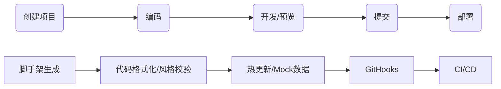

# 工程化流程

  


## 脚手架

### 脚手架结构

- 制定 cli 入口文件

```javascript

// package.json

{

'bin':'cli.js'

}

```

- cli 入口文件头部

```javascript

// ./cli.js

#!/usr/bin/env node

```

- 命令结构

```javascript

cli <command> [options] --options params

<!-- // eg: -->

vue create my_app -p env=...

```

  

### npm 包本地开发

  

- 链接本地 npm 包的依赖库

  

```javascript

// xxx-lib dir

npm link

// current module package.json

dependencies:{

+ "xxx-lib":"^1.0.0"

}

// current module dir

npm link xx-lib

```

  

- 解除本地 xxx-lib 和当前包的链接

  

```javascript

// xxx-lib dir

npm unlink

// current module dir

rm -rf node_modules

npm unlink xxx-lib

```

  

- 链接当前项目到全局`node_modules`

```javascript

npm link/unlink

```

- 相对于当前`node_modules`操作

```javascript

npm link B // 添加依赖B

npm unlink B // 移除依赖B

```

### 模版引擎

  

[EJS](https://ejs.co/#docs)

  

```html

<!-- app/templates/bar.html -->

<body>

<div><%=name %></div>

</body>

```

  

```javascript

// app/index.js

// 模版文件路径

const tmpl = this.templatePath("bar.html");

const output = this.destinationPath("bar.html");

const context = this.answers;

this.fs.copyTpl(tmpl, output, context);

```

  

生成

  

```html

<body>

<div>123</div>

</body>

```

  

### Plop

  

小型的脚手架工具,[=>](https://github.com/plopjs/plop)

  

### 使用

  

11. 项目中安装 plop

```bash

yarn add plop

```

12. `plopfile.js`

```javascript

module.exports = plop => {

plop.setGenerator('component',{

description:'create a component',

prompts:[

{

type:'input',

name:'name',

message:'your component name',

default:'My Component'

}

],

actions:[ // 多个action

{

type:'add'// 添加文件

path:'src/components/{{name}}/{{name}}.js',

templateFile:'plop-templates/component.hbs'

},

{

type:'add',

path:'src/components/{{name}}/{{name}}.css',

templateFile:'plop-template/component.css.hbs'

}

]

})

}

```

13. 模版文件

[handlebars](https://github.com/handlebars-lang/handlebars.js)

  

```javascript

// plop-templates/components.hbs

import React from 'react'

export default () => {

<div className="{{name}}">

<h1>{{name}} Component</h1>

</div>

}

```

  

14. usage

```javascript

yarn plop component

```

  

## 构建工具

  

### npm script

  

```javascript

"script":{

"build":"sass main.sass main.css -watch",

"preserve":"yarn build",

"serve":"browser-sync .", // browser-sync

"start":"run-p build serve" // npm-run-all

}

```

### ~~FIS~~

~~看看就好[fis3](https://github.com/fex-team/fis3)~~

## 打包工具

### Parcel
**0 配置**
[https://parceljs.org/](https://parceljs.org/)

## 校验

### ESLint

[https://eslint.org/docs/user-guide/getting-started](https://eslint.org/docs/user-guide/getting-started)

### StyleLint

- [lint-stage](https://github.com/okonet/lint-staged)快速配置

### Prettier

- 注意与eslint冲突

```js

yarn add eslint-config-prettier

```

```js

// eslint config

"extends": [

"react-app",

"react-app/jest",

"prettier" ++

]

```

### Husky

- prepare husky

```javascript

// 在安装npm包时自动启用

npm set-script prepare "husky install"

```

- pre commit

### Git

- commit message交互式提交工具

  

[cz](https://github.com/commitizen/cz-cli)

  

- commit message校验

[commitlint](https://commitlint.js.org/#/)

- changelog格式化生成

```js

standard-version

```

### 发版工具

[semantic-release](https://github.com/semantic-release/semantic-release/blob/master/docs/usage/getting-started.md#getting-started)