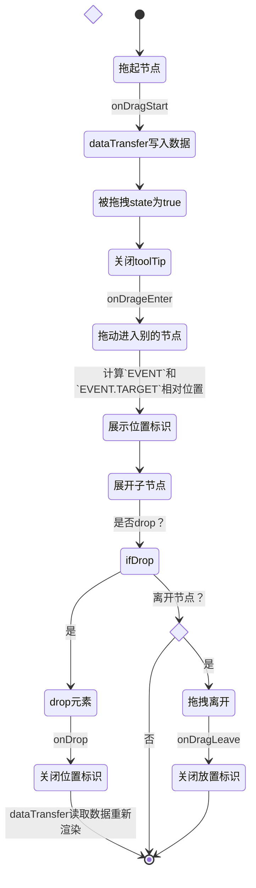

## 触发事件
1. `onDrag`
- 被拖拽元素
1. `onDragStart`
2. `onDragOver`
3. `onDragEnd`
- 目标元素
5. `onDrop`
- 途中经过元素/目标元素
7. `onDragEnter`
8. `onDragLeave`
## DOMEvent
- `DragEvent`
	- 继承`MouseEvent`和`Event`
	- 指针设备触发
	- 通过[DragEvent.dataTransfer](https://developer.mozilla.org/zh-CN/docs/Web/API/DragEvent/dataTransfer)传输数据
## 数据传递
- [`DataTransfer.setData()`](https://developer.mozilla.org/zh-CN/docs/Web/API/DataTransfer/setData)
- [`DataTransfer.getData()`](https://developer.mozilla.org/zh-CN/docs/Web/API/DataTransfer/getData)
## 树形控件上的执行流程
