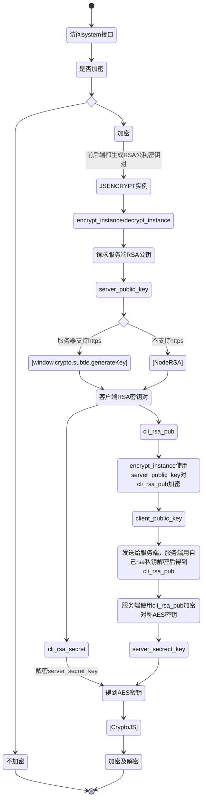

## 加密方式
1. 加密
2. 签名

### 加密

#### 依赖库
1. JSEncrypt
	1. 进行RSA加密解密
	2. 用来处理公钥
2. NodeRsa
	1. 非https环境下不能使用window.crypto.subtle.generateKey生成RSA密钥对
3. CryptoJS
	1. 使用AES标准快速加解密
	2. AES使用对称密钥

#### 实现流程
- 对称密钥交换

- 以SESSION为有效期
- 每次请求时各自生成新的AES密钥
### 签名
1. 请求头中sign字段对整个header及body对象做MD5